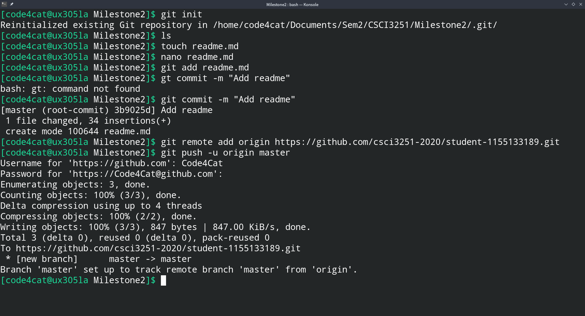

# About me

Hi, I am Tong Kai Tik, Dickson. I am a Year 1 CS student. I love **cats**.
I am new to Github!

# Programming languages

  - Java
  - Python
  - C / C++ / C++++ (a.k.a. C#)
  - JavaScript
  - PHP
  - COBOL [cripples the mind; its teaching should, therefore, be regarded as a criminal offense.](https://www.goodreads.com/quotes/496316-the-use-of-cobol-cripples-the-mind-its-teaching-should)

# Study Plan
[x] CSCI3170 Intro to Database Systems
[x] CSCI3180 Principles of Programming Lang
[x] CSCI3250 Computers and Society
[x] CSCI3251 Engineering Practicum
[ ] UGEA2110 An Intro to Chinese Culture

# Exam Time Table
| Course |    Date   |
|:-----|:------:|
|ENGG1120|07/05/2020|
|CSCI3180|19/05/2020|

# One of my favourite songs
 I just wanted to share with you one of my favourite songs  :smiley:
 **Porter Robinson & Madeon - Shelter**

# Screenshot
